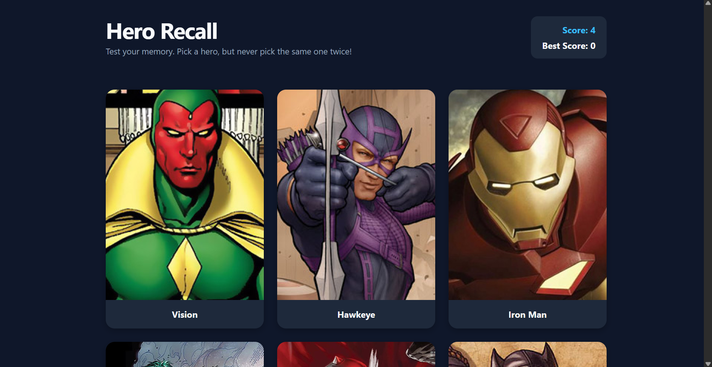

# Hero Recall

Hero Recall is a React-based memory card game built around a simple challenge: **how many superheroes can you remember without clicking the same one twice?**

The game fetches superhero data from the Superhero API and presents a selection of 12 heroes. After every successful selection, the cards are shuffled, forcing you to rely on memory rather than position.

## Live Demo

**Live:** [https://memory-card-game-delta-nine.vercel.app/]

## Screenshots




## Features

* Fetches superhero data from the Superhero API
* Displays 12 pre-selected superheroes
* Cards shuffle after every successful selection
* Tracks the current score
* Tracks the best score
* Detects repeated card selections
* Game-over state when a previously selected hero is clicked
* Victory state after successfully selecting all 12 heroes
* Play Again functionality
* Loading state while fetching superhero data
* Error handling for failed API requests
* Responsive card grid for desktop, tablet, and mobile
* Interactive hover and focus states
* Keyboard-accessible card interactions

## Built With

* React
* JavaScript (ES6 Modules)
* HTML5
* CSS3
* Vite
* Superhero API

## How to Play

1. Click on any superhero card.
2. After each successful selection, all cards are shuffled.
3. Remember which superheroes you have already clicked.
4. Avoid clicking the same superhero twice.
5. Clicking a previously selected superhero ends the game.
6. Successfully selecting all 12 superheroes wins the game.
7. Click **Play Again** to start a new round.

## What I Learned

This project helped me practice and reinforce:

* Building reusable React components
* Passing data and event handlers through props
* Managing application state with `useState`
* Fetching external data with `useEffect`
* Handling asynchronous operations with `async` / `await`
* Implementing loading and error states
* Conditional rendering based on application state
* Using callback functions as event handlers
* Updating arrays immutably in React
* Working with derived state and state-dependent UI
* Implementing game logic with multiple pieces of state
* Shuffling arrays and updating rendered data
* Creating responsive layouts with CSS Grid
* Organizing styles into component-specific CSS files
* Using CSS custom properties to maintain a consistent design system
* Adding keyboard focus states for accessibility

## Project Structure

```text
src/
├── components/
│   ├── Card.jsx
│   ├── Header.jsx
├── styles/
│   ├── App.css
│   ├── Card.css
│   ├── global.css
│   └── Header.css
├── App.jsx
└── main.jsx
```

## Installation

Clone the repository:

```bash
git clone https://github.com/abdullahrashid359/memory-card-game.git
```

Navigate to the project directory:

```bash
cd memory-card-game
```

Install dependencies:

```bash
npm install
```

Start the development server:

```bash
npm run dev
```

Create a production build:

```bash
npm run build
```

## API

Superhero data is provided by the **Superhero API**.

https://github.com/akabab/superhero-api

The application uses the API's complete superhero dataset and filters it down to the 12 heroes used in the game.

## Acknowledgements

This project was completed as part of **The Odin Project** React course in the Full Stack JavaScript Path.

https://www.theodinproject.com/lessons/node-path-react-new-memory-card